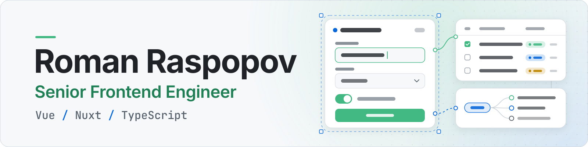
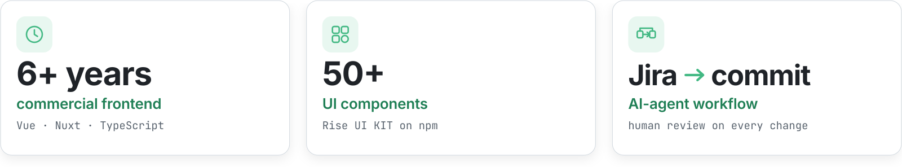
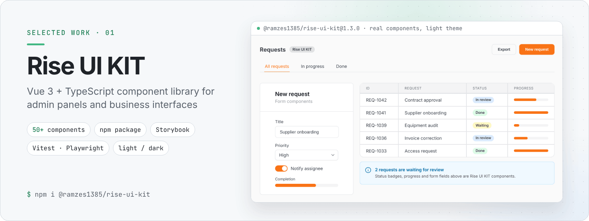
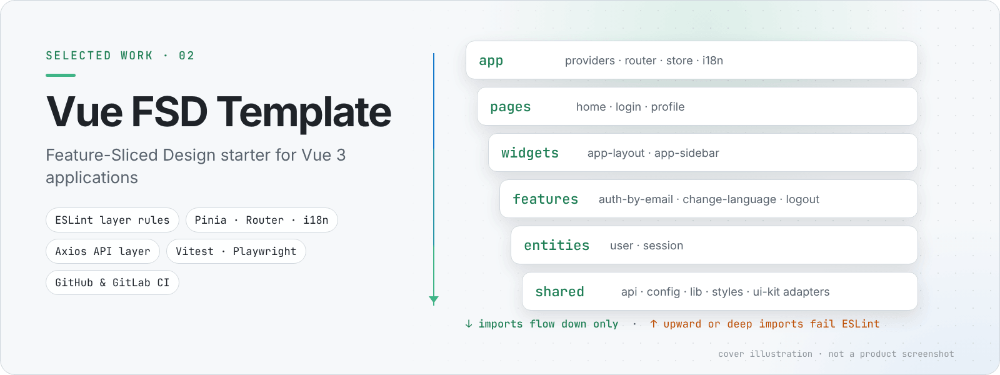
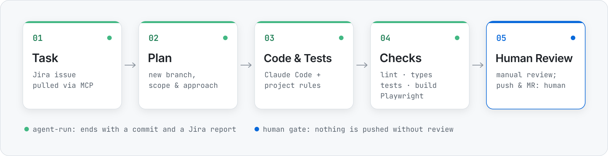

<picture>
  <source media="(prefers-color-scheme: dark)" srcset="assets/banner-dark.svg">
  
</picture>

<h3 align="center">Roman Raspopov — Senior Frontend Engineer</h3>

  I build complex business interfaces in Vue and TypeScript — forms, tree tables, dashboards and document workflows. 
  Teams get a clear frontend architecture, reusable UI components and an AI-agent workflow that delivers checked, reviewable code.

  
  
  
  

<picture>
  <source media="(max-width: 600px) and (prefers-color-scheme: dark)" srcset="assets/glance-mobile-dark.svg">
  <source media="(max-width: 600px)" srcset="assets/glance-mobile-light.svg">
  <source media="(prefers-color-scheme: dark)" srcset="assets/glance-dark.svg">
  
</picture>

##  Selected work

<a href="https://github.com/Ramzes1385/Rise-UI-KIT">
  <picture>
    <source media="(prefers-color-scheme: dark)" srcset="assets/cover-rise-ui-kit-dark.png">
    
  </picture>
</a>

**Rise UI KIT** — a Vue 3 + TypeScript component library for admin panels and business interfaces. 
**My part:** author and maintainer — component architecture, typed public API, Storybook docs, quality gates and automated npm releases. 
**Key tech:** Vue 3 · TypeScript · Vite · SCSS · Storybook · Vitest · Playwright (e2e + visual regression) · semantic-release

<a href="https://github.com/Ramzes1385/template-vue-fsd-optimize-project">
  <picture>
    <source media="(prefers-color-scheme: dark)" srcset="assets/cover-vue-fsd-template-dark.png">
    
  </picture>
</a>

**Vue FSD Template** — a starter for Vue 3 applications built on Feature-Sliced Design. 
**My part:** author — layer boundaries enforced with ESLint, app providers, an Axios API layer, SCSS design tokens, test setup and CI configs for GitHub and GitLab. 
**Key tech:** Vue 3 · TypeScript · Vite · Pinia · Vue Router · vue-i18n · Vitest · Playwright

##  Core stack

**Frontend**

<picture>
  <source media="(prefers-color-scheme: dark)" srcset="https://skillicons.dev/icons?i=vue%2Cnuxtjs%2Cts%2Cjs%2Cpinia%2Cgraphql%2Capollo&theme=dark">
  
</picture>

  Composition API · SPA / SSR · Vuex · REST

**Architecture & UI**

<picture>
  <source media="(prefers-color-scheme: dark)" srcset="https://skillicons.dev/icons?i=vite%2Cwebpack%2Ctailwind%2Csass%2Cvuetify&theme=dark">
  
</picture>

  Feature-Sliced Design · UI kits · legacy refactoring · responsive and accessible UI

**Quality & delivery**

<picture>
  <source media="(prefers-color-scheme: dark)" srcset="https://skillicons.dev/icons?i=vitest%2Cjest%2Ccypress%2Cdocker%2Cgithubactions%2Cgitlab%2Cjenkins&theme=dark">
  
</picture>

   code review · CI/CD

**AI workflow**

   

##  How I build

<picture>
  <source media="(max-width: 600px) and (prefers-color-scheme: dark)" srcset="assets/workflow-mobile-dark.svg">
  <source media="(max-width: 600px)" srcset="assets/workflow-mobile-light.svg">
  <source media="(prefers-color-scheme: dark)" srcset="assets/workflow-dark.svg">
  
</picture>

I write the rules agents follow — project instructions in `CLAUDE.md` and rule files — and a Claude Code skill that runs the loop: it pulls the Jira issue through MCP, creates a branch, writes code and tests, runs lint, type checks, tests and the build, checks the result in a real browser with Playwright, then commits and reports back to Jira. Generated code always goes through manual review; pushing and merge requests stay with a human. I also use agents to generate TypeScript models from OpenAPI specs, draft tests and pre-check changes.

##  Experience highlights

- Built **10+ production interfaces** and integrated **20+ REST API methods**
- Developed **multi-level forms with 35+ fields** and **tree tables for processing 300+ requests**
- Created a **UI kit documented in Storybook** and designed frontend architecture on **Feature-Sliced Design**
- Implemented **electronic document management** interfaces, **e-signature** integration and a **real-time messenger**

<b>More about my work</b>

- Technical leadership on the frontend: task breakdown and code review
- Integrations: REST, OpenAPI, GraphQL (Apollo Client, GraphQL Code Generator), Socket.io
- Delivery: Vite, Webpack, Docker, CI/CD with GitLab CI/CD, GitHub Actions and Jenkins
- Adjacent experience: Node.js / NestJS backend tasks; integrations with WordPress, 1C-Bitrix and Bitrix CRM
- English: B2

##  GitHub activity

<picture>
  <source media="(prefers-color-scheme: dark)" srcset="https://github-readme-stats.vercel.app/api/top-langs/?username=Ramzes1385&layout=compact&hide_border=true&langs_count=4&bg_color=0D1117&title_color=42B883&text_color=E6EDF3">
  
</picture>

##  Contact

